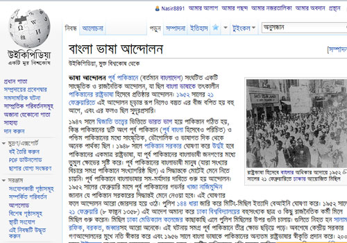

## উইকিপিডিয়া নিবন্ধের সাধারণ কাঠামো

উইকিপিডিয়াতে বিভিন্ন বিষয়ের উপর নিবন্ধ রয়েছে। বিষয়ের উপর ভিত্তি করে নিবন্ধগুলোর আকার, তথ্যের পরিমান ভিন্ন হয়ে থাকে। তবে প্রতিটি উইকিপিডিয়ার নিবন্ধই একটি সাধারণ গঠন পদ্ধতি থাকে। তবে সকল নিবন্ধই যে এই কাঠামোতে লেখা হয় এমন না। প্রয়োজন অনুযায়ী বিভিন্ন বিষয় ভিত্তিক নিবন্ধগুলোর জন্য নিবন্ধগুলোর আলাদা আলাদা কাঠামো ব্যবহার করা হয়ে থাকে। যেমন&nbsp; কোনো ব্যক্তি সম্পর্কিত নিবন্ধ এবং ঐতিহাসির স্থানের নিবন্ধের কাঠামো একই ধরনের হবে না। উইকিপিডিয়ার সাধরণ অনুচ্ছেদগুলো হল।

**ভূমিকা**

উইকিপিডিয়ার প্রতিটি নিবন্ধের একই ভূমিকা অনুচ্ছেদ থাকতে হয়। নিবন্ধটি সম্পর্কে সাধারন ধারনা দেয়া এবং সামগ্রিক বিষযের উপর আলোকপাত করা হয় এই অনুচ্ছেদে। নিবন্ধে বিশেষ কোনো অংশে বেশি গুরুত্ব দেয়ার প্রয়োজন হলে সেই বিষয়টি এই অনুচ্ছেদে উল্লেখ করা হতে পারে। তবে কখনোই কোনো বিষয়ে বিস্তারিত আলোচনা শুরু করা যাবে না এই অনুচ্ছেদে।

**ইনফোবক্স**

নিবন্ধে ভূমিকার মতই ইনফোবক্স একটি গুরুত্বপূর্ণ অংশ। ভূমিকাতে যে তথ্যগুলো বর্ণনার ভঙ্গিতে লেখা হয় তার অনেক তথ্যই সংযোজন করা হয় ইনফোবক্সে। তবে এখানে উল্লেখ করা হয় অত্যান্ত সংক্ষিপ্তভাবে। নিবন্ধের বিষয়ের সাথে সরাসরি যে তথ্যগুলোর জানার প্রয়োজন হতে পারে বা যে তথ্যগুলো উল্লেখ করা জরুরী সেগুলো সংযোজন করা হয় এই ইনফোবক্সে।

**অন্যন্য অনুচ্ছেদ**

নিবন্ধের প্রথম অনুচ্ছেদ হল "ভূমিকা", "ইনফোবক্স" এই ভুমিকারই একটি অংশ। এর পরে নিবন্ধের বিষয় অনুযায়ী বিভিন্ন অনুচ্ছের সংযোজন করা হয়ে থাকে।

**তথ্যসূত্র**

প্রতিটি নিবন্ধে তথ্যসূত্র অনুচ্ছেদটি থাকতে হবে। উইকিপিডিয়ার মূলনীতি অনুযায়ী নিবন্ধের প্রতিটি তথ্যে এর সূত্র উল্লেখ করতে হবে। উইকিপিডিয়াতে তথ্যসূত্র সংযোজনের কিছু নির্দিষ্ট ফরম্যাট রয়েছে।

**আরও দেখুন**

নির্দিষ্ট নিবন্ধের সাথে সম্পর্কিত উইকিপিডিয়ার অন্যন্য নিবন্ধের লিংক, বিষয়ের সাথে প্রাসঙ্গিক টেমপ্লেট, অন্যন্য উইকিপ্রকল্প যেমন উইকিমিডিয়া কমন্স, উইকি সংকলন ইত্যাদি স্থানে নিবন্ধের বিষয়ের সাথে সামঞ্জস্যপূর্ণ লিংকগুলো যুক্ত করা হয়।

**বহিঃসংযোগ**

নিবন্ধের বিষয়ের সাথে প্রসঙ্গিক তথ্যের লিংক যুক্ত করা হয় এখানে। এই লিংকগুলো উইকিমিডিয়া বা এর অন্যান্য কোনো সহ প্রকল্পের লিংক নয়। অন্যান্য কোনো ওয়েবসাইট, বই বা অন্যন্য কোনো সূত্রের সংযোগগুলো উল্লেখ করা হয় এই অনুচ্ছেদে।
